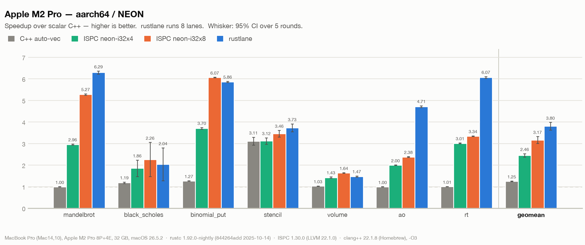
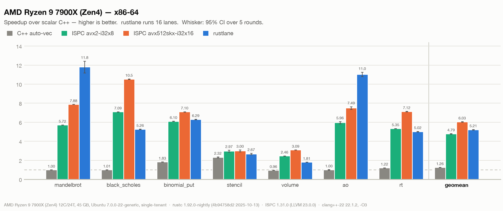

# rustlane

**rustlane brings an ISPC-style SPMD programming model to Rust as a pure
library** — you write natural scalar-looking control flow (`if`, `while`,
`for`, `break`, early `return`) over *varying* values, and proc macros lower it
to masked SIMD over nightly `std::simd`. No compiler fork, no external
toolchain: just `#[kernel]`, `#[export]`, and `foreach!`.

> rustlane is an independent project, not affiliated with Intel.

## Status

Experimental. Nightly-only. The API is unstable and will change without
notice.

## What a kernel looks like

The SPMD idea: write one program as if it runs on a single lane, and the
library runs it across a whole SIMD vector of lanes at once. Control flow that
diverges between lanes is handled for you. Here is the Mandelbrot escape-time
kernel — plain `for` / `if` / `break` over *varying* values:

```rust
#![feature(portable_simd)]
use rustlane::prelude::*;
use rustlane::kernel;

#[kernel]
fn mandel(c_re: Varying<f32>, c_im: Varying<f32>, count: i32) -> Varying<i32> {
    let mut z_re = c_re;
    let mut z_im = c_im;
    let mut ret = Varying::splat(0);
    for i in 0..count {
        if z_re * z_re + z_im * z_im > 4.0 {
            break;
        }
        let new_re = z_re * z_re - z_im * z_im;
        let new_im = 2.0 * z_re * z_im;
        unmasked! {
            z_re = c_re + new_re;
            z_im = c_im + new_im;
        }
        ret = i + 1;
    }
    ret
}
```

The macro rewrites this into masked `std::simd`: the varying `if`/`break`
become per-lane mask updates and blends (`ret = i + 1` stores only into lanes
still iterating), and the `for` loop keeps running until every lane's mask is
off, so a lane that has already escaped stops contributing without stopping the
others.

## Quick start

Nightly only. Select the nightly toolchain and add rustlane to your dependencies:

```toml
# rust-toolchain.toml
[toolchain]
channel = "nightly"

# Cargo.toml
[dependencies]
rustlane = "0.1.0"
```

A `#[kernel]` is the per-lane program; an `#[export]` is the all-uniform entry
point that drives it with `foreach!` and is callable as an ordinary safe Rust
function:

```rust
#![feature(portable_simd)]
use rustlane::prelude::*;
use rustlane::{export, kernel};

#[kernel]
fn scale(x: Varying<f32>, factor: f32) -> Varying<f32> {
    x * factor
}

#[export]
fn scale_all(input: &[f32], output: &mut [f32], factor: f32) {
    foreach!(i in 0..input.len() {
        output[i] = scale(input[i], factor);
    });
}

fn main() {
    let input: Vec<f32> = (0..1024).map(|v| v as f32).collect();
    let mut output = vec![0.0f32; input.len()];
    scale_all(&input, &mut output, 2.0);
    assert_eq!(output[10], 20.0);
}
```

## Performance

Seven kernels from ISPC's own example suite (`options` contributes two),
measured against Intel ISPC on two machines. `#[export]` dispatches to the
widest target the CPU supports — 8 lanes on the M2 Pro, 16 on the Zen4 box —
and the ISPC target at that same width is the orange bar.





Geometric mean of rustlane / ISPC runtime at matched width:

| Machine | rustlane | ISPC | ratio |
|---|---|---|---:|
| Apple M2 Pro | 8 lanes | `neon-i32x8` | **0.83** |
| AMD Ryzen 9 7900X (Zen4) | 16 lanes | `avx512skx-i32x16` | **1.16** |

Each round is 3 warm-up reps plus an internal min-of-15 (mandelbrot: 20); five
rounds run interleaved over every binary in a fixed order with 2 s cool-downs.
Bars are the mean over the five rounds, whiskers a 95% t interval. Every round
validated its output against the ISPC reference. Full toolchain versions are
printed under each chart; per-round raw timings land in `results/<arch>.csv`.

The C++ columns are the same source at `-O3`; `scalar` adds
`-fno-vectorize -fno-slp-vectorize`.

```sh
make -C ispc-ref build-all       # ISPC + C++ baselines (needs ispc, clang++)
cargo build --release
./rustlane-bench/measure.sh      # ~25 min
python3 rustlane-bench/parse_measurements.py aarch64   # or x86_64
python3 rustlane-bench/make_charts.py aarch64          # or x86_64
```

## What works

- `if` / `else` with divergent (varying) conditions
- `while` (varying condition) / `for` / bare `loop`, with `break` / `continue` /
  early `return` under divergence
- `unmasked! { .. }` — an all-lanes block, for loop-carried locals
- `cif!` / `cwhile!` — opt-in coherent control flow (ISPC-style `any()` guards)
- `foreach!` / `foreach_2d!` / `foreach_tiled!` — inline iteration, no closures
- `#[derive(SpmdValue)]` — a struct vectorizes to a generated SoA type `VaryingS<N>`;
  `#[spmd(uniform)]` keeps a field scalar
- `math` — ISPC-ported transcendentals (`exp` / `log` / `pow` / `sin` / `cos` / `rsqrt` / `rcp`)
- `rng` — LFSR113 combined-Tausworthe varying RNG
- `reduce` — horizontal reductions and cross-lane ops (broadcast / rotate / shift / scan / pack)
- Runtime target dispatch: SSE2 / SSE4.1 / AVX2 / AVX-512 on x86-64, NEON on aarch64

Nightly is required and will stay required: `Varying<T, N>` is built on
`#![feature(portable_simd)]`, which is unstable upstream.

## Not planned

- **`Varying<S>` for a struct `S`.** `Varying<T, N>` is `repr(transparent)` over
  `Simd<T, N>`, so `T` has to be a scalar. Structs go through
  `#[derive(SpmdValue)]` to SoA instead.
- **`match` on a varying scrutinee.** Bindings, guards and exhaustiveness have
  no lane-wise meaning, and anything that does have one is an `if` / `else`
  chain written out. Use that.
- **Explicit generic arguments on a kernel call** (`k::<8>(x)`). The macro
  supplies `::<N, _>` itself.

## Static safety

The dangerous SPMD mistakes are compile errors, not silent races. Assigning to
a *uniform* (scalar) variable while lanes are diverging would make every lane
race on one location, so there is simply no such trait impl — the write fails
to type-check with a domain-specific diagnostic:

```text
error[E0277]: cannot assign to a value of type `i32` under execution context `VMask<N>`
  --> tests/ui/uniform_assign.rs:14:7
   |
14 |     s = 5;
   |       ^ this assignment target cannot be written under the current control-flow mask
   |
   = note: assigning to a uniform (scalar) variable under VARYING control flow is
     not supported: every lane would race on one location. Make the variable a
     `Varying`, hoist the assignment out of the varying branch, or wrap it in
     `unmasked!` if all-lanes semantics are intended
```

Two safety properties hold by construction:

- **Inactive lanes never touch memory.** Every masked gather/scatter carries
  the active mask as its hardware enable, so an out-of-bounds index on a
  masked-off lane neither faults nor affects results.
- **48-case compile-fail diagnostics suite.** The static rejection rules for
  `#[kernel]` and `#[export]` are pinned by 48 checked-in
  `trybuild` snapshots — each asserts the error span points at the offending
  user token — plus an additional case covering the `SpmdValue` derive.

## How it works

Each execution context (all-on, a uniform branch bool, a varying mask, a
uniform branch under a varying mask) is a distinct Rust *type* that the macro
threads through the kernel as a hidden first parameter; every operator,
assignment, and control-flow construct resolves against that type by trait, so
the macro itself never inspects a value or a type. Because the context is a
type and the "is this uniform?" test is a `const`, monomorphization deletes the
mask machinery on every path that turns out uniform: a kernel entered all-on
compiles down to plain scalar branches and contiguous vector loads, with blends
emitted *only* where control flow is genuinely divergent. There are no
unconditional coherence guards — the one `any()` reduction per loop is the loop
exit check, not a per-`if` tax. The whole kernel tree is `#[inline(always)]`, so
`#[export]` can stamp it out once per SIMD target inside a `#[target_feature]`
shim and pick the widest at runtime with a single cached indirect call.

## License

Licensed under the [MIT License](LICENSE).

Portions of the benchmark kernels and math routines are ported from Intel's
ISPC examples under their original BSD-3-Clause terms; see
[THIRD-PARTY.md](THIRD-PARTY.md) for the full attributions.
